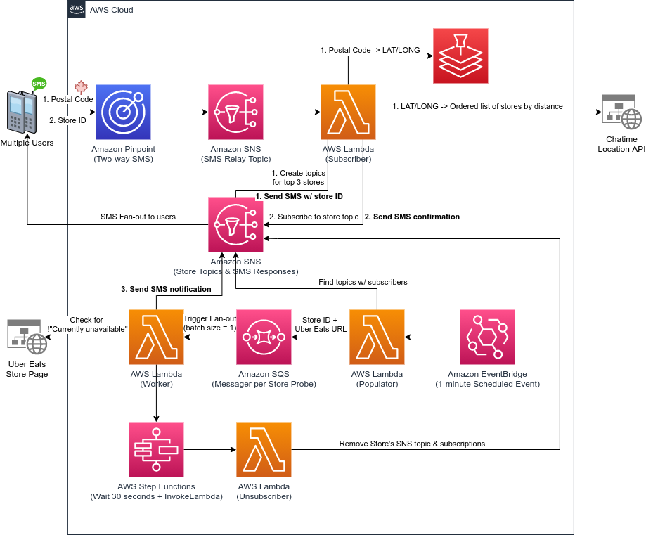
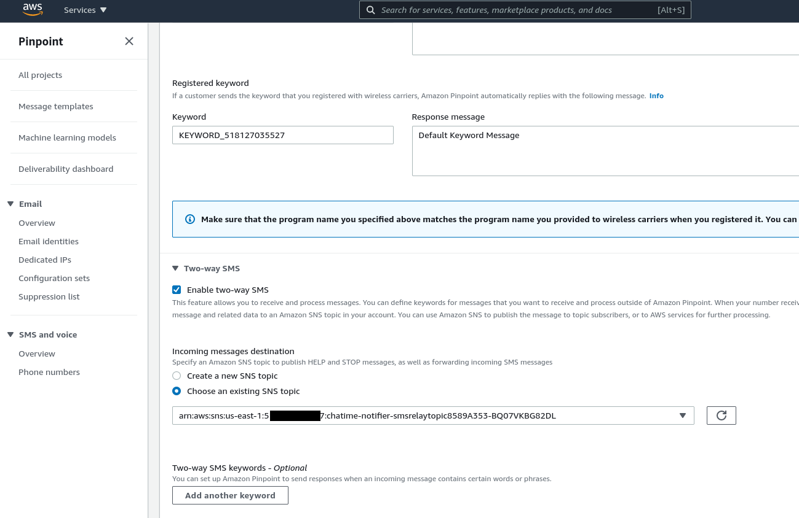

# cdk-serverless-chatime-ordering-helper

This CDK app deploys a series of serverless resources that allow an end-user to be notified via SMS when a Chatime store location is available for online ordering.  To interface with the app the end-user sends SMS messages to a predefined Amazon Pinpoint SMS-enabled long code phone number.

1. User -- SMS --> App: Send Canadian Postal Code (ex. M5J0A8)
2. App -- SMS --> User: List of 3 closest Chatime store locations
3. User -- SMS --> App: Store ID of desired store
4. App -- SMS- -> User: Confirmation of monitoring

Another flow exists as well that happens behind the scenes that eventually results in a notification to the end-user.

## Architecture



## Requirements

- AWS Account
- **Amazon Pinpoint w/ a Long code phone number with SMS enabled**
- Docker
- Node.js
- CDK

## How to deploy

If you have any trouble following these instructions, please see [CDK Workshop](https://cdkworkshop.com/) for necessary background knowledge.

### 1. Install node dependencies

```
yarn install
```

### 2. Configuration (cdk.context.json)

Create a `cdk.context.json`, and populate the Amazon Pinpoint Long code phone number as the originationNumber.

```
{
  "originationNumber": "+19022019412"
}
```

### 3. Deploy

```
yarn deploy
```

Once deployment has completed, you'll need to **make note** of the outputs.

```
Outputs:
chatime-notifier.smsrelaytopicoutput = arn:aws:sns:us-east-1:5************7:chatime-notifier-smsrelaytopic8589A353-BQ07VKBG82DL
```

### 4. Update Amazon Pinpoint to route SMS messages to the deployed SNS topic

In the AWS Management Console head over to Amazon Pinpoint and update the long code phone number so that Two-way SMS is enabled and the SNS topic is set to the output from the deployment above.  See the following for an example:

